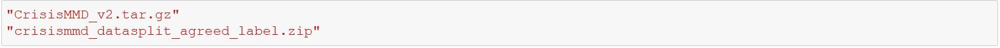

# SummerInternship
## Multimodal Tweets Classification Using CrisisMMD Dataset
In this internship, my objective was to improve the classification performance over the previous best on the CrisisMMD multimodal dataset, consisting of image and text modality, by building multimodal deep learning architecture utilizing both image and text data. For more information please refer **Summer Internship Report.pdf** provided in this repository.
## Download Dataset
To experiment with script first download dataset from here: https://crisisnlp.qcri.org/crisismmd, rename the file as shown in the figure give below then put these two file in data folder of this repository.

