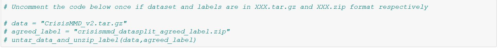

# SummerInternship
## Multimodal Tweets Classification Using CrisisMMD Dataset
In this internship, my objective was to improve the classification performance over the previous best on the CrisisMMD multimodal dataset, consisting of image and text modality, by building multimodal deep learning architecture utilizing both image and text data. For more information please refer [**Summer Internship Report.pdf**](https://drive.google.com/file/d/177EX2311f3tq7bVUX69qtlkImfA3ecSf/view?usp=sharing).
## Download Dataset
To experiment with the script first download dataset from here: [CrisisMMD_Dataset](https://crisisnlp.qcri.org/crisismmd), rename the files as shown in the figure given below then put these two file in **data** folder of this repository.

While running the notebook uncomment codeblock, as given below, once to untar and uzip data.

